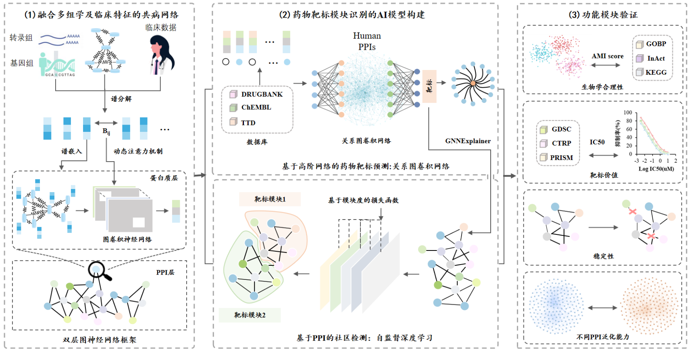
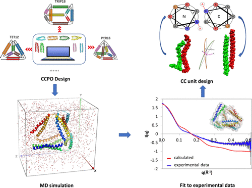
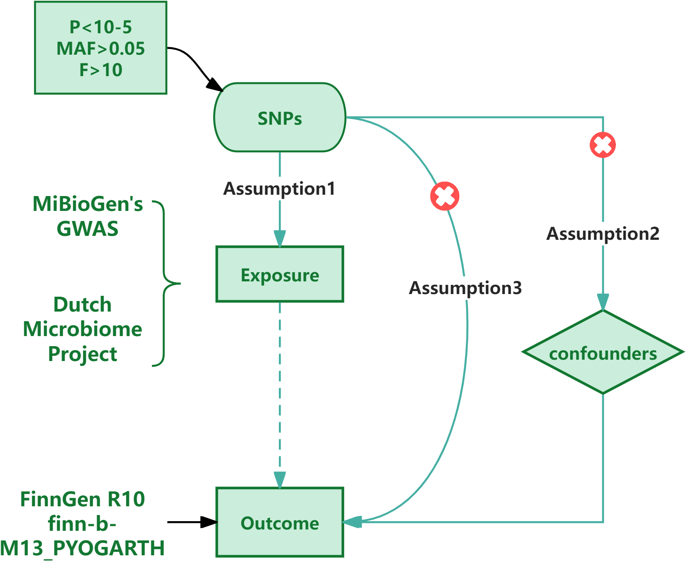

Hi！I am Longfei Luo, a third-year undergraduate student majoring in **Bioinformatics** at the School of Life Sciences, Soochow University. I am currently conducting research in the lab of **Professor Guang Hu**, Department of Bioinformatics and Computational Biology.

My research interests lie in **AI for Life Sciences**, with particular focus on **AI-driven drug discovery (AIDD)**. I am broadly interested in developing computational models across both **molecular and network levels** to facilitate the understanding and design of effective therapeutics.

On the **molecular level**, I explore deep learning approaches for protein structure modeling and simulation. On the **systems level**, I focus on the **theoretical modeling and application of graph neural networks (GNNs) in large-scale biological networks**, aiming to capture how drugs perturb complex network structures and to uncover the underlying mechanisms of drug action.

By integrating insights across these complementary layers, my long-term goal is to contribute to mechanism-based and data-driven strategies for **precision drug development**.

🔬 Recent Research：Endotype-Oriented Drug Target Module Discovery
======

Phenotypically distinct diseases may share common **molecular endotypes**, which opens the door to **endotype-based drug repositioning** [Zhou et al., *Trends Pharmacol Sci*, 2022](https://www.cell.com/trends/pharmacological-sciences/pdf/S0165-6147(21)00221-2.pdf). Instead of treating symptoms, this approach aims to identify shared biological mechanisms and repurpose existing drugs to target novel indications based on mechanism-level similarity.

To support this goal, we develop deep learning-based methods for **disease target module discovery** from large-scale biological networks. The pipeline is illustrated as follows:

Specifically, we construct a **two-layer graph neural network framework**:

1. **Protein Embedding Layer**  
   A graph convolutional network (GCN) is used to embed **protein structural features** into a low-dimensional latent space, providing informative representations for downstream analysis.

2. **Disease Module Detection Layer**  
   A graph attention network (GAT) is applied to the **protein-protein interaction (PPI) network**, performing **community detection** to identify candidate **disease-associated modules**.

3. **Targetability Analysis**  
   Known drug targets are projected onto the identified modules, and **topological proximity** and **perturbation impact** are jointly analyzed to evaluate the **targeting potential** of each module.

This research direction bridges **artificial intelligence and systems biology**, and seeks to support **rational drug design** by providing quantitative frameworks for analyzing drug effects across molecular and cellular systems. I am broadly interested in integrating data-driven machine learning approaches with biological network modeling to advance **quantitative biology**.

📝 Publications
======

<table>
  <tr>
    <td width="35%">
      
    </td>
    <td>
      <b>Comparative Simulative Analysis and Design of Single-Chain Self-Assembled Protein Cages</b> 
      Xiao F, <b>Luo L</b>, Liu X, et al. 
      <i>J Phys Chem B</i>, 128(26):6272–6282, 2024. 
      DOI: <a href="https://doi.org/10.1021/acs.jpcb.4c01957" target="_blank">10.1021/acs.jpcb.4c01957</a> 
      🔗 <a href="https://pubs.acs.org/doi/10.1021/acs.jpcb.4c01957" target="_blank">Paper</a>
    </td>
  </tr>

  <tr>
    <td>
      
    </td>
    <td>
      <b>The causal relationship between the human gut microbiota and pyogenic arthritis: a Mendelian randomization study</b> 
      Bai B, <b>Luo L</b>, Yao F, et al. 
      <i>Front Cell Infect Microbiol</i>, 14:1452480 (2024). 
      DOI: <a href="https://doi.org/10.3389/fcimb.2024.1452480" target="_blank">10.3389/fcimb.2024.1452480</a> 
      🔗 <a href="https://www.frontiersin.org/articles/10.3389/fcimb.2024.1452480/full" target="_blank">Paper</a>
    </td>
  </tr>
</table>

📘 My Algorithmic Learning Journey
------
I have actively pursued foundational and advanced machine learning training through both self-guided study and structured academic programs. The following resources and courses have significantly shaped my understanding of deep learning and graph-based models:

- 📖 **《深度学习入门：基于Python的理论与实现》**, by Yasuki Saito (斋藤康毅) [link](https://github.com/qiaohaoforever/DeepLearningFromScratch)
  Often referred to as the "fish book" (鱼书) in the Chinese ML community, this classic textbook provided me with a solid foundation in neural network principles, backpropagation, and basic model implementation using Python and NumPy.

- 🧬 **Machine Learning in Biomedical Sciences and Bioengineering**  
  A specialized course offered through the 2024 *International Top Talent Cultivation Program*, instructed by **Professor James Choi** (Imperial College London).  
  The course covered biomedical applications of machine learning including supervised/unsupervised learning, SVM, random forests, LSTM, and GCNs, with a focus on real-world bioengineering problems.

- 🌐 **Stanford CS224W: Machine Learning with Graphs**  [link](https://web.stanford.edu/class/cs224w/)
  Taught by **Professor Jure Leskovec**, this world-renowned course deepened my understanding of graph neural networks, node/edge embedding, message passing, and graph-level prediction tasks.  
  It helped bridge the gap between theoretical foundations and practical applications in large-scale biological networks.

